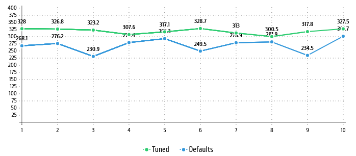

## Подготавливаем окружение
- Создал машинку в YC via TF. Через user-data прокинул публичный ключ.
```bash
sudo apt-get update
sudo apt-get install \
    ca-certificates \
    curl \
    gnupg \
    lsb-release -y
```


- Устанавливаем PostgreSQL 14
```bash
sudo sh -c 'echo "deb http://apt.postgresql.org/pub/repos/apt $(lsb_release -cs)-pgdg main" > /etc/apt/sources.list.d/pgdg.list' && wget --quiet -O - https://www.postgresql.org/media/keys/ACCC4CF8.asc | sudo apt-key add - 
sudo apt-get update
sudo apt-get install \
  postgresql-14 -y
```
Добавляем необходимые настройки в файл конфигурации ```/etc/postgresql/14/main/postgresql.conf```
```
max_connections = 40
shared_buffers = 1GB
effective_cache_size = 3GB
maintenance_work_mem = 512MB
checkpoint_completion_target = 0.9
wal_buffers = 16MB
default_statistics_target = 500
random_page_cost = 4
effective_io_concurrency = 2
work_mem = 6553kB
min_wal_size = 4GB
max_wal_size = 16GB
```
Дописал в конец файла, т.к. конфигурация читается сверху вниз.

- Запускаем pgbench

```bash
postgres@fhm6k4estpg9t439hc2e:/etc/postgresql/14/main$ pgbench -i postgres
dropping old tables...
NOTICE:  table "pgbench_accounts" does not exist, skipping
NOTICE:  table "pgbench_branches" does not exist, skipping
NOTICE:  table "pgbench_history" does not exist, skipping
NOTICE:  table "pgbench_tellers" does not exist, skipping
creating tables...
generating data (client-side)...
100000 of 100000 tuples (100%) done (elapsed 0.12 s, remaining 0.00 s)
vacuuming...
creating primary keys...
done in 1.15 s (drop tables 0.00 s, create tables 0.01 s, client-side generate 0.92 s, vacuum 0.09 s, primary keys 0.13 s).
```
Текущие настройки autovaccum
```SQL
postgres=# SELECT name, setting, context, short_desc FROM pg_settings WHERE name like 'autovacuum%';
                 name                  |  setting  |  context   |                                        short_desc                                         
---------------------------------------+-----------+------------+-------------------------------------------------------------------------------------------
 autovacuum                            | on        | sighup     | Starts the autovacuum subprocess.
 autovacuum_analyze_scale_factor       | 0.1       | sighup     | Number of tuple inserts, updates, or deletes prior to analyze as a fraction of reltuples.
 autovacuum_analyze_threshold          | 50        | sighup     | Minimum number of tuple inserts, updates, or deletes prior to analyze.
 autovacuum_freeze_max_age             | 200000000 | postmaster | Age at which to autovacuum a table to prevent transaction ID wraparound.
 autovacuum_max_workers                | 3         | postmaster | Sets the maximum number of simultaneously running autovacuum worker processes.
 autovacuum_multixact_freeze_max_age   | 400000000 | postmaster | Multixact age at which to autovacuum a table to prevent multixact wraparound.
 autovacuum_naptime                    | 60        | sighup     | Time to sleep between autovacuum runs.
 autovacuum_vacuum_cost_delay          | 2         | sighup     | Vacuum cost delay in milliseconds, for autovacuum.
 autovacuum_vacuum_cost_limit          | -1        | sighup     | Vacuum cost amount available before napping, for autovacuum.
 autovacuum_vacuum_insert_scale_factor | 0.2       | sighup     | Number of tuple inserts prior to vacuum as a fraction of reltuples.
 autovacuum_vacuum_insert_threshold    | 1000      | sighup     | Minimum number of tuple inserts prior to vacuum, or -1 to disable insert vacuums.
 autovacuum_vacuum_scale_factor        | 0.2       | sighup     | Number of tuple updates or deletes prior to vacuum as a fraction of reltuples.
 autovacuum_vacuum_threshold           | 50        | sighup     | Minimum number of tuple updates or deletes prior to vacuum.
 autovacuum_work_mem                   | -1        | sighup     | Sets the maximum memory to be used by each autovacuum worker process.
```
PGBench:
```
postgres@fhm6k4estpg9t439hc2e:/etc/postgresql/14/main$ pgbench -c8 -P 60 -T 600 -U postgres postgres
pgbench (14.6 (Debian 14.6-1.pgdg100+1))
starting vacuum...end.
progress: 60.0 s, 268.1 tps, lat 29.800 ms stddev 52.645
progress: 120.0 s, 276.2 tps, lat 28.937 ms stddev 57.403
progress: 180.0 s, 230.9 tps, lat 34.625 ms stddev 80.326
progress: 240.0 s, 279.4 tps, lat 28.621 ms stddev 56.945
progress: 300.0 s, 293.3 tps, lat 27.250 ms stddev 50.240
progress: 360.0 s, 249.5 tps, lat 32.042 ms stddev 86.566
progress: 420.0 s, 278.9 tps, lat 28.666 ms stddev 48.168
progress: 480.0 s, 281.9 tps, lat 28.358 ms stddev 24.101
progress: 540.0 s, 234.5 tps, lat 34.098 ms stddev 83.380
progress: 600.0 s, 301.7 tps, lat 26.499 ms stddev 62.787
transaction type: <builtin: TPC-B (sort of)>
scaling factor: 1
query mode: simple
number of clients: 8
number of threads: 1
duration: 600 s
number of transactions actually processed: 161679
latency average = 29.669 ms
latency stddev = 61.848 ms
initial connection time = 21.945 ms
tps = 269.458737 (without initial connection time)
postgres@fhm6k4estpg9t439hc2e:/etc/postgresql/14/main$ 
```

Настраиваем autovacuum:
```bash
autovacuum_max_workers = 1 # т.к. 2 ядра
autovacuum_naptime = 3 # recomendations
vacuum_cost_limit = 200
autovacuum_vacuum_scale_factor = 0.05
autovacuum_analyze_scale_factor = 0.05
autovacuum_analyze_threshold = 50 
autovacuum_vacuum_threshold = 50
vacuum_cost_page_hit = 0
vacuum_cost_page_miss = 5
vacuum_cost_page_dirty = 5
autovacuum_vacuum_cost_delay = 5ms
autovacuum_vacuum_cost_limit = -1
```

Перезапускаем PGBench и получаем следующие результаты:
```bash
postgres@fhm6k4estpg9t439hc2e:/etc/postgresql/14/main$ pgbench -c8 -P 60 -T 600 -U postgres postgres
pgbench (14.6 (Debian 14.6-1.pgdg100+1))
starting vacuum...end.
progress: 60.0 s, 328.0 tps, lat 24.352 ms stddev 51.413
progress: 120.0 s, 326.8 tps, lat 24.462 ms stddev 51.261
progress: 180.0 s, 323.2 tps, lat 24.738 ms stddev 20.094
progress: 240.0 s, 307.6 tps, lat 25.986 ms stddev 60.729
progress: 300.0 s, 317.1 tps, lat 25.209 ms stddev 51.692
progress: 360.0 s, 328.7 tps, lat 24.320 ms stddev 59.831
progress: 420.0 s, 313.0 tps, lat 25.538 ms stddev 64.982
progress: 480.0 s, 300.5 tps, lat 26.600 ms stddev 63.277
progress: 540.0 s, 317.8 tps, lat 25.149 ms stddev 48.405
progress: 600.0 s, 327.5 tps, lat 24.414 ms stddev 47.831
transaction type: <builtin: TPC-B (sort of)>
scaling factor: 1
query mode: simple
number of clients: 8
number of threads: 1
duration: 600 s
number of transactions actually processed: 191420
latency average = 25.056 ms
latency stddev = 53.217 ms
initial connection time = 23.283 ms
tps = 319.026972 (without initial connection time)

```
Получили прирост TPS ~15%

